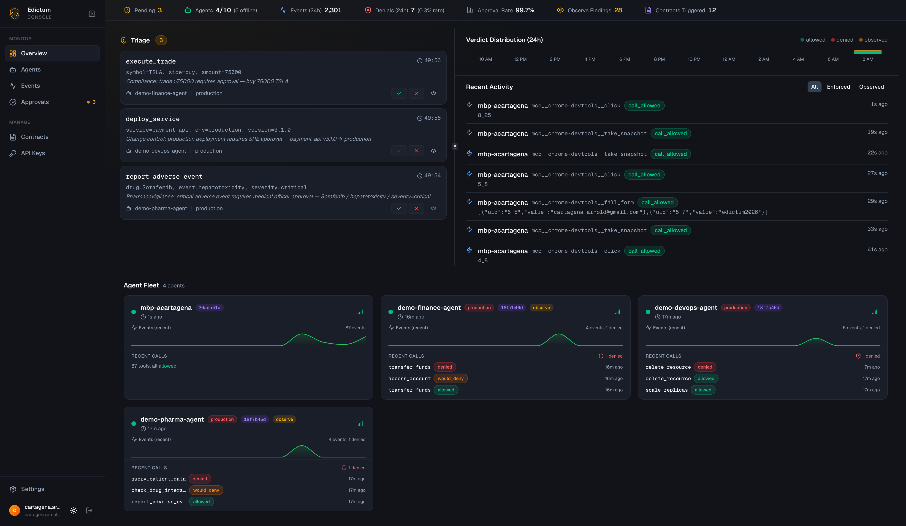
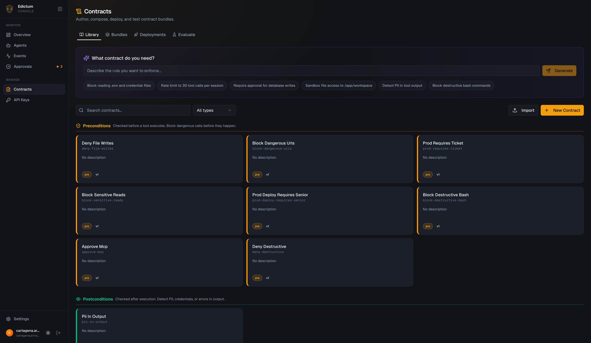
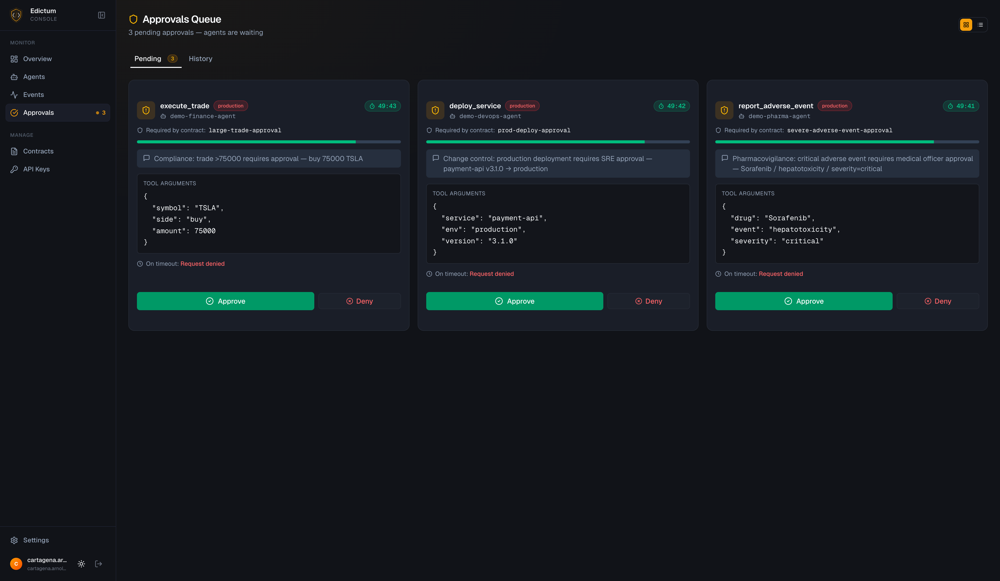
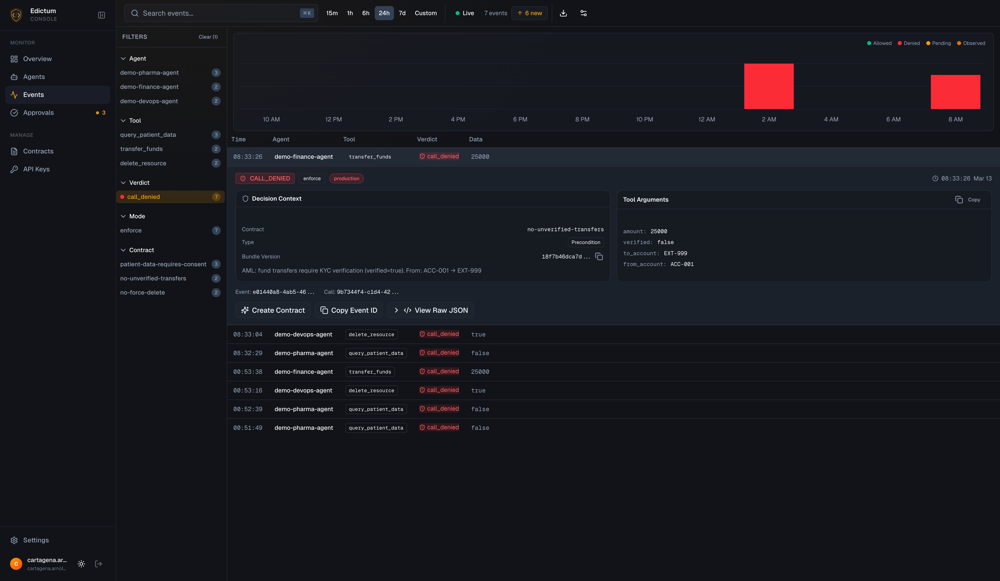
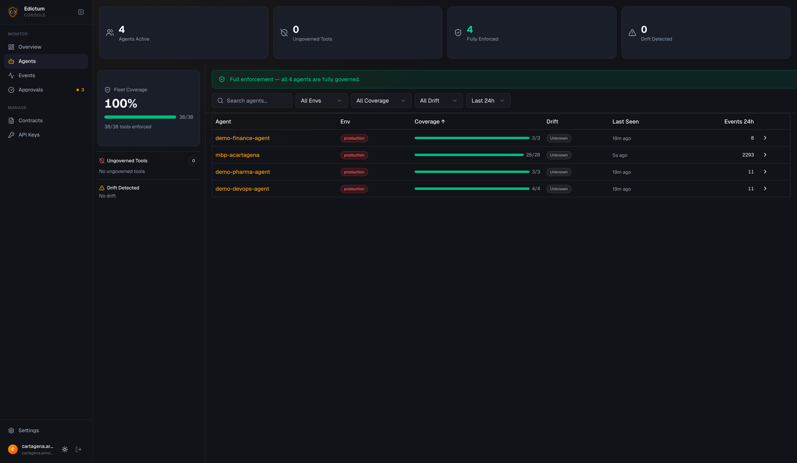

# Edictum Console

[](LICENSE.md)
[](https://www.python.org/)
[](https://ghcr.io/edictum-ai/edictum-console)

Self-hostable operations console for governed AI agents.

[Edictum](https://github.com/edictum-ai/edictum) enforces contracts. Edictum Console shows you what happened, and lets you change what happens next -- without restarting agents.

## Why This Exists

You deployed edictum contracts to your agent fleet. Tool calls are governed. But now:

**No visibility.** An agent denied a call in production at 3 AM. Which contract? Which tool? What were the arguments? You grep through logs and find a one-line denial message.

**No live updates.** You tuned a contract. To pick it up, every agent needs a restart. In production. With active sessions.

**No approval workflow.** Your agent needs human sign-off before a destructive operation. The contract says `effect: approve`. But where does the request go? Who sees it?

Edictum Console solves all three. One Docker image. Five minutes to deploy.

<p align="center">
  
</p>

## Quick Start

```bash
# 1. Download the compose file
curl -fsSL https://raw.githubusercontent.com/edictum-ai/edictum-console/main/deploy/docker-compose.yml -o docker-compose.yml

# 2. Create .env with your secrets
cat <<EOF > .env
POSTGRES_PASSWORD=$(python3 -c "import secrets; print(secrets.token_hex(16))")
EDICTUM_SECRET_KEY=$(python3 -c "import secrets; print(secrets.token_hex(32))")
EDICTUM_SIGNING_KEY_SECRET=$(python3 -c "import secrets; print(secrets.token_hex(32))")
EOF

# 3. Start everything
docker compose up -d

# 4. Open http://localhost:8000/dashboard/setup
#    Create your admin account

# 5. Create an API key
#    Dashboard > API Keys > Create Key > Copy the full key (shown once)
```

Connect your agent:

```python
from edictum import Edictum

guard = await Edictum.from_server(
    url="http://localhost:8000",
    api_key="edk_production_CZxKQvN3mHz...",
    agent_id="my-agent",
    env="production",
    bundle_name="my-contracts",
)

# Same API as local edictum -- events stream to console,
# approvals route through dashboard, contract updates arrive via SSE.
result = await guard.run("read_file", {"path": "data.csv"}, read_file)
```

## What You Get

### Contract Management

Versioned contract library with composition model:

| Level | What it is | Purpose |
|-------|-----------|---------|
| **Contract** | Individual governance rule | Authoring unit. Versioned. Reusable across bundles. |
| **Composition** | Ordered recipe of contracts | Assembly recipe. Per-contract mode overrides. |
| **Bundle** | Assembled, signed YAML | Deployed artifact. Pushed to agents via SSE. |

Bundle versioning, YAML diff viewer, evaluation playground, and AI contract assistant (Anthropic, OpenAI, OpenRouter, Ollama).

<p align="center">
  
</p>

### Live Hot-Reload

Deploy a contract -- connected agents pick it up instantly. Zero downtime.

- SSE push to subscribed agents, filtered by environment and bundle
- Ed25519 signed bundles with key rotation
- Auto-reconnect with exponential backoff

### Human-in-the-Loop Approvals

Agent requests approval -- notification fires -- human approves or denies -- agent proceeds.

- Dashboard queue with timer badges and bulk actions
- Interactive approve/deny buttons in Telegram, Slack, and Discord
- Configurable timeout with deny or allow fallback
- Rate-limited (10 requests per 60 seconds per agent)

<p align="center">
  
</p>

### Notification Channels

Six channel types. Configure in the dashboard -- no env vars, no restarts.

| Channel | Interactive | Notes |
|---------|:-----------:|-------|
| Telegram | Yes | Inline keyboard buttons |
| Slack App | Yes | Block Kit action buttons |
| Slack Webhook | No | One-way with deep link |
| Discord | Yes | Component buttons |
| Webhook | No | Generic HTTP POST with optional HMAC |
| Email | No | SMTP with deep link |

Routing filters per channel: environments, agent patterns (globs), contract names.

### Audit Event Feed

Datadog-style three-panel layout: faceted filter sidebar, time-sorted event list with histogram, and full event detail. URL-driven filters for sharing views. PostgreSQL-partitioned by month.

<p align="center">
  
</p>

### Fleet Monitoring

- Live connected agents with environment, bundle, and policy version
- Drift detection per agent (current vs deployed bundle)
- Coverage analysis: every tool classified as enforced, observed, or ungoverned
- Agent detail pages with coverage, analytics, and contract change history

<p align="center">
  
</p>

### Agent Assignment

Three-level bundle resolution: explicit assignment > pattern-matching rules > agent-provided. Bulk assignment, dry-run resolution preview, glob patterns for agent matching.

## Architecture

Single Docker image. FastAPI serves the React SPA and API from one process.

```
GET /dashboard/*     -> React SPA
GET /api/v1/*        -> FastAPI API
GET /api/v1/stream   -> SSE stream (API key auth)
GET /api/v1/health   -> Health check
```

**Stack**: FastAPI + SQLAlchemy 2.0 + Alembic + Postgres 16 + Redis 7 + React 19 + TypeScript + Vite + Tailwind + shadcn/ui.

> **Note:** The current release supports a single console instance. SSE events are broadcast in-process; multi-instance deployments behind a load balancer require the Redis pub/sub bridge, which is on the [roadmap](https://docs.edictum.ai/docs/roadmap). Running multiple instances today will result in agents missing SSE events from other instances.

> **Note:** The console server does not emit OpenTelemetry telemetry in the current release. Centralized observability (OTel spans on API requests, metrics export, and fleet-wide OTel configuration) is [planned](https://docs.edictum.ai/docs/roadmap#planned-centralized-observability).

## How It Connects to Edictum

```
+-----------------------------+     +----------------------------------+
|  Your Agent Process         |     |  Edictum Console (this repo)     |
|                             |     |                                  |
|  edictum (core library)     |     |  FastAPI + React SPA             |
|  +- Evaluates contracts     |     |  +- Contract management          |
|  +- Enforces tool calls     |     |  +- Deployment + SSE push        |
|  +- Fails closed            |     |  +- Approval workflow            |
|                             |     |  +- Audit event storage          |
|  edictum[server] (SDK)      |<--->|  +- Fleet monitoring             |
|  +- ServerAuditSink         |     |  +- Notification fan-out         |
|  +- ServerApprovalBackend   |     |                                  |
|  +- ServerBackend           |     |  Postgres + Redis                |
|  +- ServerContractSource    |     |  Single Docker image             |
+-----------------------------+     +----------------------------------+
```

**Core is standalone.** `Edictum.from_yaml("contracts.yaml")` works without a server. Console is an optional enhancement.

**`pip install edictum[server]`** adds the SDK:

| SDK Class | Purpose |
|-----------|---------|
| `EdictumServerClient` | HTTP client (base_url, api_key, agent_id) |
| `ServerAuditSink` | Batched event ingestion (50 events / 5s flush, 10K buffer) |
| `ServerApprovalBackend` | HITL approval polling (2s interval) |
| `ServerBackend` | Session state storage (atomic increment) |
| `ServerContractSource` | SSE contract subscription (auto-reconnect) |

Console never evaluates contracts in production. Agents evaluate locally. Console stores events, manages approvals, and pushes contract updates.

## Deploy

### Docker Compose (recommended)

```bash
cp .env.example .env
# Fill in secrets (see Environment Variables below)
docker compose up -d
```

### Published Image

```bash
docker pull ghcr.io/edictum-ai/edictum-console:latest
```

### Railway

`railway.toml` included. Health check at `/api/v1/health`.

## Security

- **Fail closed**: Server unreachable -- errors propagate -- deny.
- **Authentication**: Local auth (email/bcrypt, min 12 chars). Server-side sessions in Redis.
- **API keys**: Env-scoped (`edk_{env}_{random}`), bcrypt hashed, prefix-indexed.
- **Tenant isolation**: Every table has `tenant_id`. Every query filters by it.
- **Cryptography**: Ed25519 bundle signing. NaCl SecretBox for secrets at rest.
- **Bootstrap lock**: Admin creation only works when zero users exist.
- **CSRF protection**: `X-Requested-With` header on cookie-auth mutating requests.
- **Rate limiting**: Login (per IP, sliding window) + approvals (per tenant+agent) + event ingestion (per tenant, 10K/min).

See [SECURITY.md](SECURITY.md) for vulnerability reporting.

## Environment Variables

| Variable | Required | Default | Purpose |
|----------|----------|---------|---------|
| `POSTGRES_PASSWORD` | Yes | -- | Postgres container password |
| `EDICTUM_SECRET_KEY` | Yes | -- | Session token signing |
| `EDICTUM_SIGNING_KEY_SECRET` | Yes | -- | Ed25519 key encryption (32-byte hex) |
| `EDICTUM_ADMIN_EMAIL` | First run | -- | Bootstrap admin email |
| `EDICTUM_ADMIN_PASSWORD` | First run | -- | Bootstrap admin password (min 12 chars) |
| `EDICTUM_BASE_URL` | No | `http://localhost:8000` | Public URL for webhooks, CORS, cookies |
| `EDICTUM_ENV_NAME` | No | `development` | `production` disables OpenAPI docs |

## API

65+ endpoints across 17 route groups. Full SDK compatibility contract in [SDK_COMPAT.md](SDK_COMPAT.md).

## Links

- [Documentation](https://docs.edictum.ai)
- [Edictum (core library)](https://github.com/edictum-ai/edictum)
- [PyPI -- edictum](https://pypi.org/project/edictum/)

## License

[FSL-1.1-ALv2](LICENSE.md) — source available, converts to Apache 2.0 after two years.
