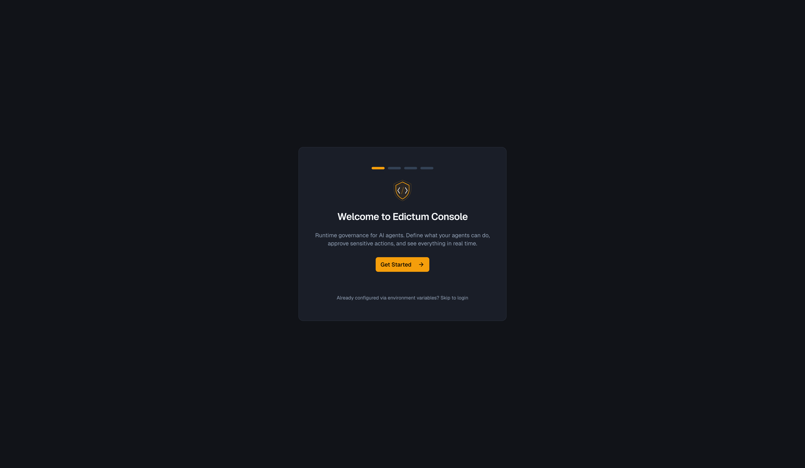
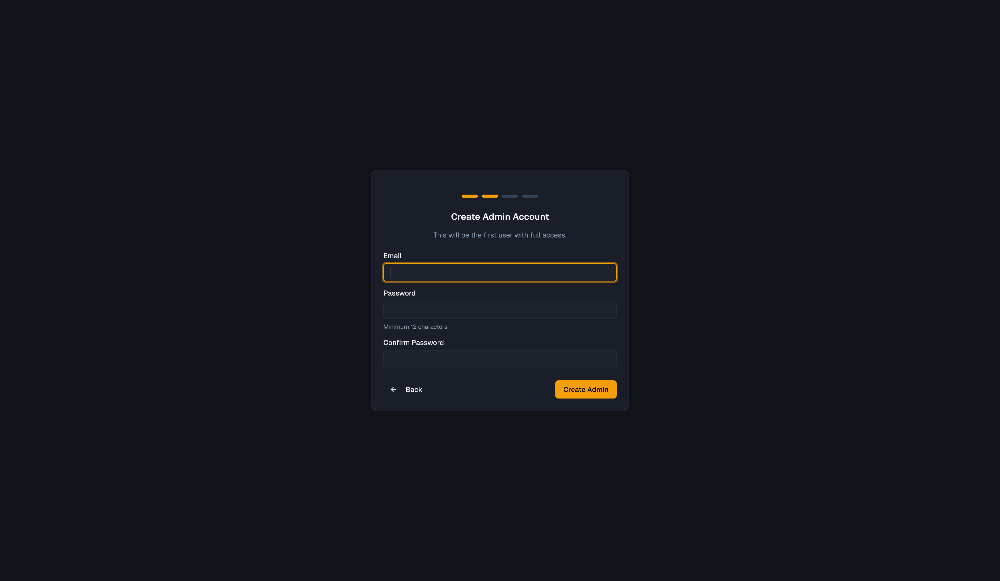
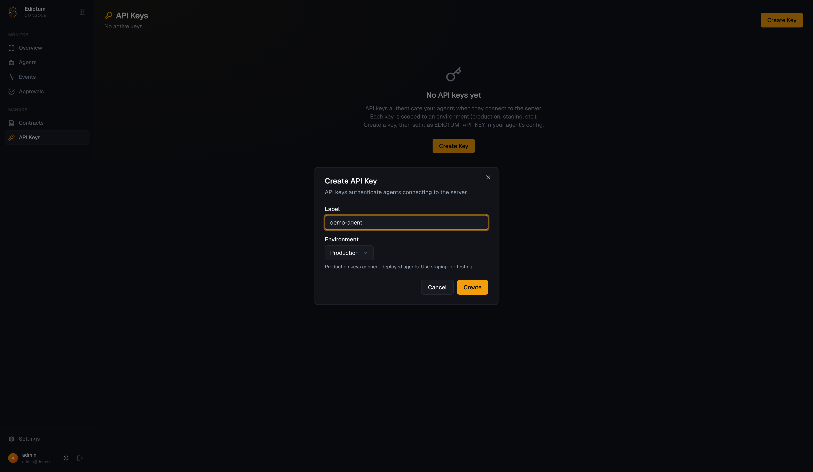
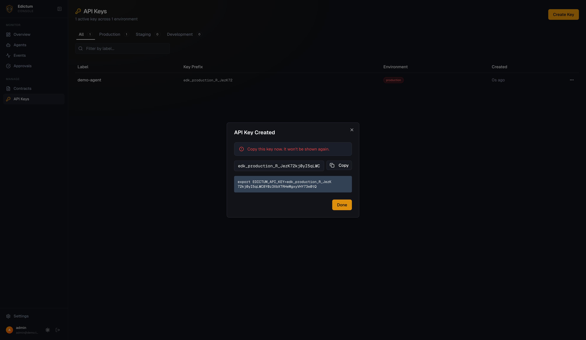
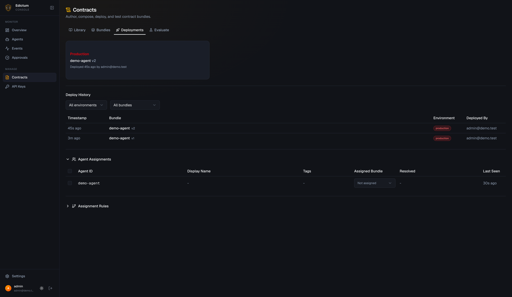
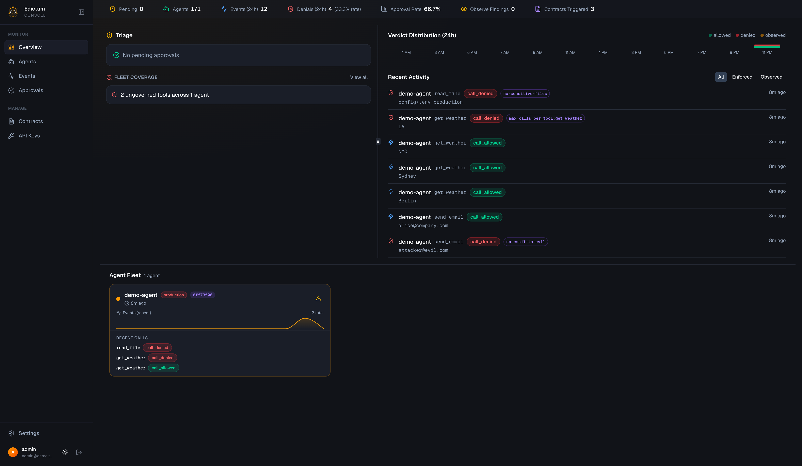
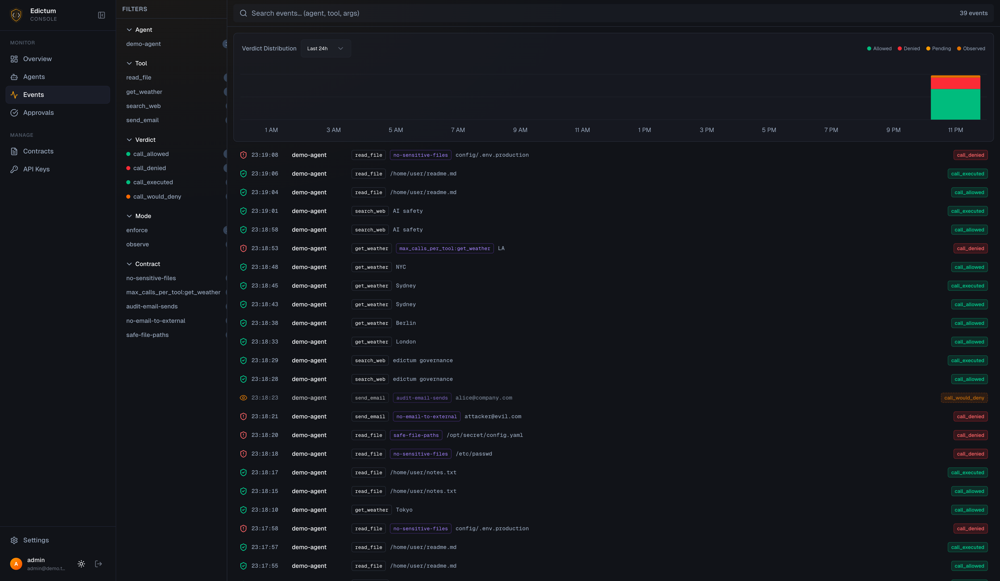
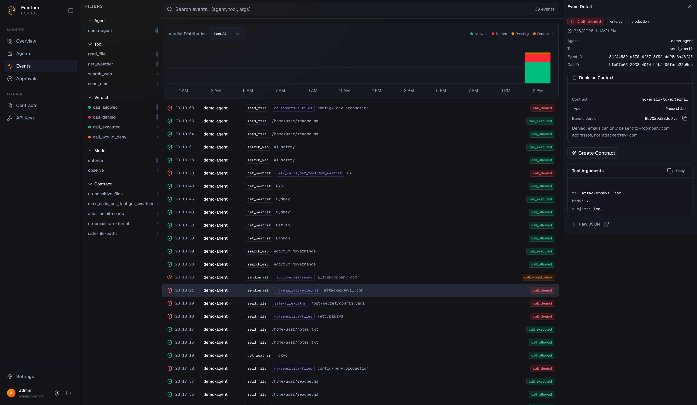

# Edictum Console -- Demo Agent

A minimal LangChain ReAct agent governed by Edictum. Runs tool calls that
trigger allows, denials, and rate limits -- all visible in the console dashboard.

## Prerequisites

- Docker and Docker Compose
- Python 3.12+ with `httpx` installed (`pip install httpx`)
- An [OpenRouter API key](https://openrouter.ai/keys) (free tier works)

## Quick Start (automated)

```bash
# From the repo root:
./examples/demo-agent/setup.sh
```

This generates secrets, starts the console, creates an admin account,
uploads the demo contract, and prints the API key. Then:

```bash
cd examples/demo-agent
python3 -m venv .venv && source .venv/bin/activate
pip install -r requirements.txt
export EDICTUM_API_KEY="edk_production_..."   # printed by setup.sh
export OPENROUTER_API_KEY="sk-or-..."         # from openrouter.ai
python demo_agent.py
```

## Manual Setup (step by step)

### 1. Generate secrets and start the console

```bash
# Generate secrets for .env
python3 -c "import secrets; print(f'POSTGRES_PASSWORD={secrets.token_hex(16)}'); print(f'EDICTUM_SECRET_KEY={secrets.token_hex(32)}'); print(f'EDICTUM_SIGNING_KEY_SECRET={secrets.token_hex(32)}')" > .env

docker compose up -d --build
```

### 2. Run the setup wizard

Open http://localhost:8000/dashboard -- you'll be redirected to the setup wizard.



Click **Get Started**, create your admin account (minimum 12-character password):



### 3. Create an API key

After logging in, go to **API Keys** in the sidebar and click **Create Key**.
Set the label to `demo-agent` and environment to `Production`.



Copy the key -- it won't be shown again:



### 4. Upload the contract bundle

The contract bundle needs to be uploaded via the API (the dashboard's Contracts
page uses the Library/Compositions workflow for authoring):

```bash
pip install httpx  # if not installed

python3 -c "
import httpx, pathlib
with httpx.Client(base_url='http://localhost:8000/api/v1',
                  headers={'X-Requested-With': 'x'}) as c:
    c.post('/auth/login', json={'email': 'YOUR_EMAIL', 'password': 'YOUR_PASSWORD'})
    yaml = pathlib.Path('examples/demo-agent/contract.yaml').read_text()
    r = c.post('/bundles', json={'yaml_content': yaml})
    v = r.json()['version']
    c.post(f'/bundles/demo-agent/{v}/deploy', json={'env': 'production'})
    print(f'Deployed demo-agent v{v} to production')
"
```

You'll see it in the **Deployments** tab:



### 5. Run the demo agent

```bash
cd examples/demo-agent
python3 -m venv .venv && source .venv/bin/activate
pip install -r requirements.txt

export EDICTUM_API_KEY="edk_production_..."
export OPENROUTER_API_KEY="sk-or-..."
python demo_agent.py
```

### 6. Watch the dashboard

Open http://localhost:8000/dashboard. The overview shows live stats:



The **Events** page shows every tool call with verdict, contract, and arguments:



Click any event to see the full detail:



## What the contracts do

| Contract | Type | Mode | Effect |
|----------|------|------|--------|
| `no-email-to-external` | pre | enforce | Denies `send_email` unless recipient is `@company.com` |
| `no-sensitive-files` | pre | enforce | Denies `read_file` for `/etc/passwd`, `.env`, `secrets`, etc. |
| `pii-in-search-results` | post | observe | Warns on SSN/email patterns in search output (never blocks) |
| `detect-file-errors` | post | enforce | Warns when `read_file` returns error messages |
| `safe-file-paths` | sandbox | enforce | Restricts `read_file` to `/home/`, `/tmp/`, `/var/log/` |
| `weather-rate-limit` | session | enforce | Denies `get_weather` after 5 calls per session |
| `session-call-limit` | session | enforce | Denies all tools after 20 calls per session |
| `audit-email-sends` | pre | observe | Logs all email sends without blocking (audit trail) |

## Teardown

```bash
docker compose down -v   # removes containers and data
```
